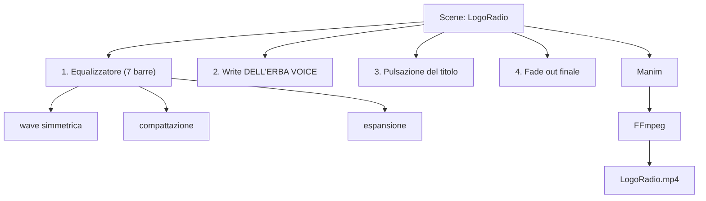

# Dell'Erba Voice: animazione del logo

[](https://www.python.org/)
[](https://www.manim.community/)

Animazione del logo della web radio scolastica Dell'Erba Voice, realizzata con la libreria Manim in Python. Il logo riprende il nome della radio e una barra di equalizzazione a 7 linee che "danza" con animazioni simmetriche e poi si compone nel testo finale.

## Caratteristiche

- **Logo animato**: testo "DELL'ERBA VOICE" con effetto di scrittura e pulsazione leggera.
- **Equalizzatore animato**: 7 barre verticali con caps che oscillano in modo simmetrico, si compattano, si espandono e infine si dissolvono.
- **Render ad alto frame rate**: 120 fps per un movimento fluido.
- **Stile brand radio**: palette calda crema (`#FFF5E1`) con rosso brand e accenti viola.

## Tech stack

- **Python 3** — scripting e logica di generazione delle forme geometriche
- **Manim (Community Edition)** — engine matematico per animazioni vettoriali
- **FFmpeg** — pipeline di encoding video e rendering ad alto frame rate

## Architettura

Una singola scena `LogoRadio` orchestra tutte le animazioni in sequenza:



Gli elementi base sono `Line` (barre), `Dot` (caps) e `Text`; l'animazione simmetrica superiore/inferiore è ottenuta con `put_start_and_end_on` e `there_and_back` come rate function.

## Struttura del progetto

```
Dellerba-voice-logo-animation/
├── LogoRadio.py     # Scena Manim (definizione completa dell'animazione)
├── LogoRadio.mp4    # Render finale (120 fps)
└── README.md
```

## Installazione e setup

Prerequisiti: Python 3.9+, [Manim Community Edition](https://docs.manim.community/) e FFmpeg.

```bash
yay -S manim ffmpeg            # Arch/Manjaro
pip install manim              # alternativa via pip

git clone https://github.com/St0rmosu/Dellerba-voice-logo-animation.git
cd Dellerba-voice-logo-animation
```

Per riprodurre il render, apri `LogoRadio.mp4` con qualsiasi player video.

## Uso

Per rigenerare l'animazione da zero:

```bash
manim render -q m LogoRadio.py LogoRadio
```

Qualità disponibili: `-q l` (480p), `-q m` (720p), `-q h` (1080p), `-q k` (2160p). L'output finisce in `media/videos/LogoRadio/`; per esportarlo nella cartella del progetto:

```bash
cp "media/videos/LogoRadio/720p30/LogoRadio.mp4" .
```

## Demo

Animazione video ad alta risoluzione (1080p @ 120 fps) generata con Manim e disponibile in `LogoRadio.mp4`.

## API

Nessuna API esterna: è un puro script di rendering offline. Le uniche interfacce sono il CLI di Manim (`manim render ...`) e la classe `LogoRadio` come punto di estensione per nuove varianti del logo.

## Decisioni di engineering

- **120 fps**: scelto per un'animazione fluida, utile soprattutto per l'equalizzatore; il costo è un render più lungo e un file più pesante.
- **Animazione simmetrica via rate function**: `there_and_back` fa sì che caps e barre si muovano in modo speculare sopra e sotto lo zero, mantenendo il design coerente.
- **Coordinate parametriche**: altezze, posizioni e spessori delle barre sono definiti in liste, per ritoccare il design senza riscrivere le animazioni.

## Limiti e prossimi passi

- Il font "Aerospace Bold" è richiesto dal codice: se assente, Manim usa un fallback e il testo può apparire diverso.
- Durata e struttura della scena sono fisse: le varianti del logo richiedono modifiche al codice.
- Prossimi passi: parametrizzare colori e tempi tramite configurazione, aggiungere varianti (logo statico, versione invertita), supportare testo alternativo per altre radio, ottimizzare con Manim a basso livello (`VectorizedVMobject`) per render più rapidi.

*Animazione creata da Lorenzo Recchia per la web radio scolastica Dell'Erba Voice.*
